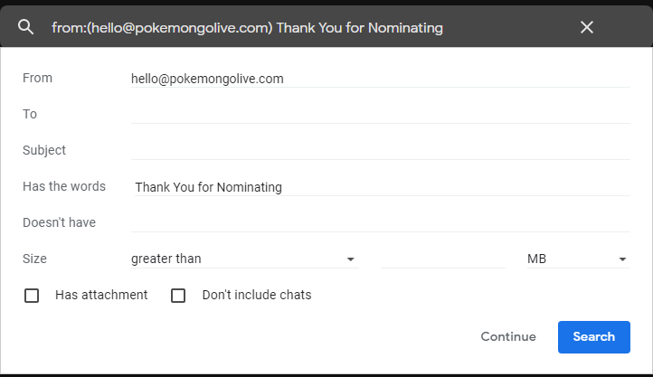

# IngressEmailParser
Parses ingress Prime emails about Portals submissions/approvals/edits.
This does not violate any TOS with Niantic and accesses only your own gmail account. This CANNOT support emails to other types of accounts or emails FW'd from others.
** THIS IS PROVIDED AS-IS USE AT YOUR OWN RISK **

# Setup
* Create a Spreadsheet in Google Docs with the following Tabs: (use EXACTLY the same name)
  * Accepted
  * Submitted
  * Edited
  * Rejected
  * Invalid\
  
* Open the Script Editor: **Tools->Script Editor**
* Delete all existing code in the window.
* Paste the contents of parser.js into the window.
* **SET YOUR DISCORD WEBHOOK URL**

* Setup the username lookup
  * replace the 'A' in the if with something in your email address
  * and the 'A' in the return statment with your name\

* Save the Project as "IngressParser" (without quotes)
* Open GMail
* Create a new label
  * "Ingress-Notifications" (without quotes)
  * "Ingress-Processed" (without quotes)
* Create a filter:
  * from:(ingress-support@nianticlabs.com OR nominations@portals.ingress.com) 
  * Has words: -"Damage Report"
  * click "Next"
  * apply label: Ingress-Notifications
  * optional: underlined in blue.
  

* One more for Pokemon Subs

* (Optional) Mission Support
  * from:(ingress-support@nianticlabs.com) 
  * Has Words: Mission Submission
* Go back the script editor and select the Trigger button

* Create a new trigger with the following trigger settings

* Hit save and an authorization window will appear.
* Sign in with your Google Email
* Hit "Advanced" then "Go to IngressParser (unsafe)"
  * **You are the only one that has any access to your data, this app is just not a fully qualified Google App.**
 
* Then hit "Allow" on the next window.
* You should now have a trigger setup.

# Setup for Users, where you don't own the sheet
* Open GMail
* Create a new label
  * "Ingress-Notifications" (without quotes)
  * "Ingress-Processed" (without quotes)
* Create a filter:
  * from:(ingress-support@nianticlabs.com OR nominations@portals.ingress.com) 
  * Has words: -"Damage Report"
  * click "Next"
  * apply label: Ingress-Notifications
  * optional: underlined in blue.
  

* One more for Pokemon Subs

* (Optional) Mission Support
  * from:(ingress-support@nianticlabs.com) 
  * Has Words: Mission Submission
* Open the Spreadsheet that has been shared with you.
* Open the Script Editor: **Tools->Script Editor**
* Go to the script editor and select the Trigger button

* Create a new trigger with the following trigger settings

* Hit save and an authorization window will appear.
* Sign in with your Google Email
* Hit "Advanced" then "Go to IngressParser (unsafe)"
  * **You are the only one that has any access to your data, this app is just not a fully qualified Google App.**
 
* Then hit "Allow" on the next window.
* You should now have a trigger setup.
